# Data-Driven-Evaluation-Of-Toronto-Apartment-Buildings

The project evaluates the conditions of Toronto apartment buildings using the **Apartment Building Evaluation Dataset** sourced from the [Open Toronto website](https://open.toronto.ca/dataset/apartment-building-evaluation/).. Through detailed analysis and interactive Tableau visualizations, the project aims to identify maintenance issues, trends, and regional disparities impacting resident satisfaction and safety. The findings are intended to support data-driven decision-making by policymakers, property managers, investors, and other stakeholders, contributing to the improvement of housing standards across the city.

## Motivation
Toronto faces a housing crisis with rising costs, strained shelter systems, and limited affordable housing. This pressures apartment maintenance, while investors lack clear insights for effective resource allocation. This project provides a comprehensive analysis to address these challenges.

---

## Objectives
- Assess the overall condition of Toronto apartment buildings.
- Identify trends in maintenance and resident satisfaction.
- Provide actionable insights for stakeholders.
- Develop an interactive Tableau dashboard for accessible data visualization.

---

## Dataset
- **Source**: [Apartment Building Evaluation Dataset](https://open.toronto.ca/dataset/apartment-building-evaluation/) (Open Toronto)
- **Characteristics**:
  - Covers buildings with 3+ stories and 10+ units.
  - Includes metrics on conditions, safety, maintenance, and satisfaction.
  - Updated daily for real-time data.

---

## Methodology
1. **Data Acquisition**: Downloaded from Open Toronto.
2. **Data Preparation**: Cleaned missing values, validated accuracy, integrated geospatial mapping.
3. **Analysis**:
   - Exploratory Data Analysis (EDA) for trends and outliers.
   - Statistical analysis for relationships.
   - Geospatial analysis for regional disparities.
   - Modelling: Developed statistical or machine learning models (e.g., regression) to predict maintenance issues and resident satisfaction based on historical data.
4. **Visualization**: Created an interactive Tableau dashboard.
5. **Automation**: Automating the whole process using Task scheduler.

---

## Workflow

```mermaid
graph TD
    A[Start: Daily Scheduled Task] --> B[Data Acquisition<br>Download latest datasets from Open Toronto]

    B --> C[Data Preparation<br>Standardize scores to 0–5<br>Merge datasets<br>Handle missing values]

    C --> D[Data Splitting<br>70% Train / 30% Test]

    D --> E[Train & Tune Models<br>CatBoost + others<br>Hyperparameter search<br>5-fold CV]

    E --> F{Model Performance<br>Satisfactory?}

    F -->|Yes| G[Generate Predictions<br>Save results CSV]

    G --> H[Update Tableau Dashboard<br>with new predictions & visuals]

    H --> I[End: Deliver Insights<br>to Stakeholders]

    F -->|No| J[Review & Adjust<br>Features / Parameters]

    J --> E

    %% Dark theme styling for black background
    classDef startEnd fill:#1a3c34,stroke:#4ade80,stroke-width:2px,color:#e0f7fa
    classDef process fill:#0d1b2a,stroke:#778da9,stroke-width:2px,color:#e0e7ff
    classDef decision fill:#370617,stroke:#9d4edd,stroke-width:2px,color:#f3e8ff
    classDef loop fill:#332200,stroke:#ffaa00,stroke-width:2px,color:#fff3e0

    class A,I startEnd
    class B,C,D,E,G,H process
    class F decision
    class J loop
```

---

## Key Findings
- **Building Conditions**: Notable disparities across neighbourhoods; common issues include structural damage and plumbing failures.
- **Resident Satisfaction**: Influenced by building age, location, and maintenance frequency.
- **Visualizations**: Heatmaps, trend graphs, and an interactive dashboard.

---

## Final Dashboard

The dashboard provides a comprehensive overview of building evaluations in Toronto. It tracks the total number of buildings evaluated (15,322), along with the timing of those evaluations (immediate, within 1, 2, or 3 years).

Key metrics include the correlation of building component condition with the overall building score (e.g., how much does the condition of the entrance lobby, exterior cladding, etc., influence the total building score) and their respective ratings (Excellent, Good, Average, Poor) based on a 0-1 scale. Geographic distribution of building scores is visualized on a map, overlaid with ward boundaries.

Further analysis is facilitated through charts displaying ward-level performance, frequency of building age (year built), and the distribution of building stories.  This allows users to understand trends and prioritize interventions based on various factors like location, age, and the influence of specific building components on overall building condition.

https://public.tableau.com/app/profile/jibin.george2730/viz/TorontoBuildingEvaluationDashboard_17334607948060/Dashboard
